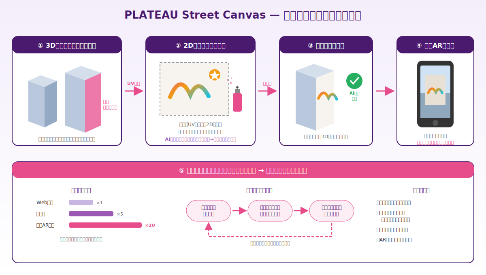
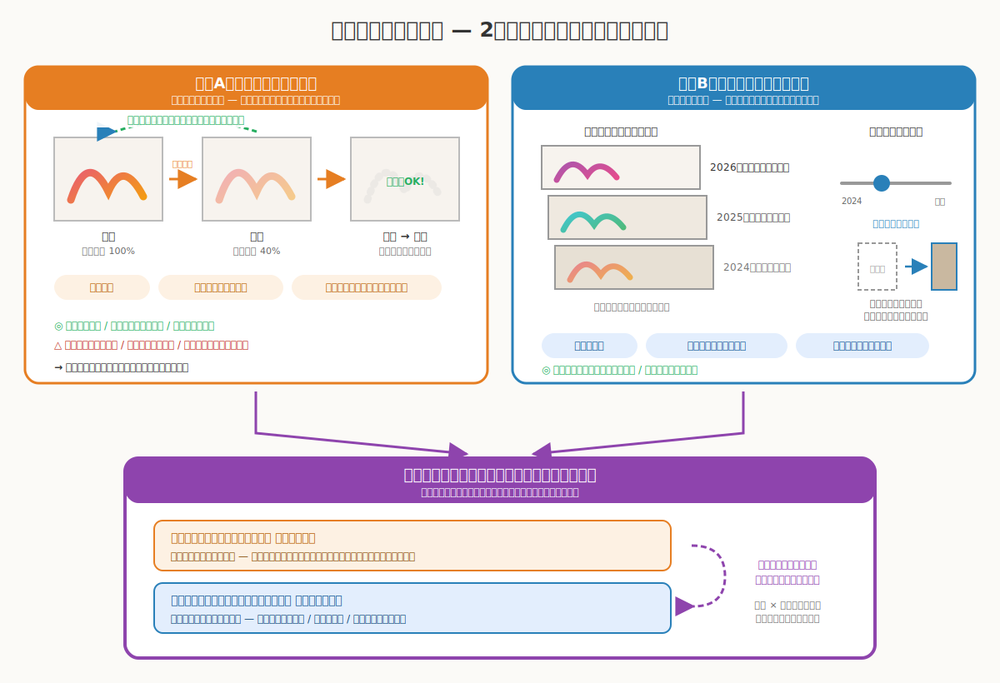
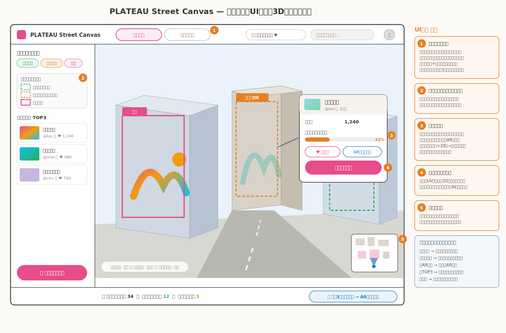
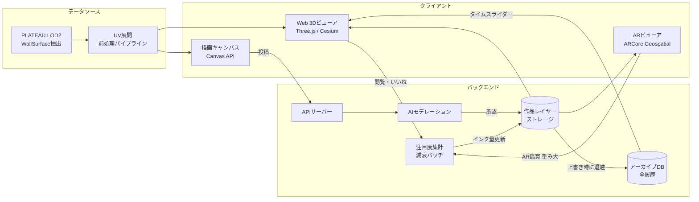

# PLATEAU Street Canvas — 都市を舞台にしたデジタルストリートアート

> **一言コンセプト**
> PLATEAUの街の壁がキャンバスになる。描いた絵は街に残り、注目を集め、やがて次の絵に受け継がれていく。



---

## 1. 背景と課題

| 課題 | 現状 |
|---|---|
| 落書き被害 | 器物損壊としての落書きは自治体・鉄道・商店の継続的な負担（清掃コスト・治安イメージ悪化） |
| 表現の場の不足 | ストリートアート・グラフィティ文化には表現エネルギーがあるが、合法的に描ける場所が極めて少ない |
| シャッター商店街 | 閉店店舗のシャッターが並ぶ景観は地域の活力低下を象徴。物理的な壁画事業はコスト・合意のハードルが高い |
| 都市と若者の距離 | 若い世代が「自分のまち」に愛着や当事者性を持つきっかけが少ない |

**「描きたい」というエネルギーを、都市を汚す行為から都市を彩る行為へ転換する。** これが本アイデアの社会的な軸。

## 2. コア体験

```
① 壁を選ぶ     3D都市ビューで「公認キャンバス」に設定された壁面を選択
      ↓
② 描く         壁面がUV展開されて2Dキャンバスに。スプレー・ブラシ・レイヤーで描画
      ↓
③ 街に公開     3D都市の壁面に再投影され、全ユーザーに共有される
      ↓
④ 鑑賞される   Web 3Dビュー / 現地スマホAR（実物大）で鑑賞。注目度が作品に蓄積
      ↓
⑤ 循環する     注目度と時間が作品のライフサイクルを駆動（→ 第4章の2モデル）
```

### 技術的な肝：壁面のUV展開と再投影

- PLATEAU LOD2建物モデルの `WallSurface` ポリゴンを抽出し、平面展開してUV座標を生成
- ユーザーはこの展開図（2Dキャンバス）上で描画。描画結果はテクスチャレイヤーとしてサーバー保存
- 3Dビューでは壁面ジオメトリにテクスチャとして合成表示。**「3Dの都市に直接描いた」体験**を2Dペイントの操作性で実現する

## 3. 注目度（Attention）システム

作品は以下から計算される**注目度スコア**を持つ。

```
注目度 = Web閲覧数 × 1 + いいね × 5 + 現地AR鑑賞 × 20 + 鑑賞滞在秒数 × 0.1
        （直近7日間の加重移動平均。古い行動ほど寄与が減衰）
```

- **現地AR鑑賞の重みを最大**にする → 「見に行く」行動を促し、**アートが人流をつくる**構造を意図的に設計
- 注目度は表示優先度・作品の寿命（後述）・ランキング・クリエイターの実績に反映

## 4. 作品のライフサイクル — 2つの設計思想

**本企画の核心的な設計判断。** ストリートアートの本質である「儚さ」をどう扱うかで、プロダクトの性格が大きく変わる。両面を検討する。



### 方向A：エフェメラルモデル —「評価が作品を生かす」

作品は生き物のように生まれ、輝き、消えていく。

#### ルール
1. 作品は**インク量（生命力）**を持ち、時間経過で毎日一定量減少する
2. 注目度を獲得するとインク量が回復する（見られ続ける絵は生き続ける）
3. インク量の減少は**視覚的な退色**として表現（鮮明 → 色あせ → 輪郭のみ → 消滅）
4. インク量が閾値を下回った作品の壁は**上書き可能**になる（リアルのグラフィティ文化における「消えかけた絵の上に描く」暗黙のルールの再現)
5. 完全消滅した壁はまっさらなキャンバスとして開放される

#### 長所
- **新陳代謝** — 街が常に更新され、何度訪れても新しい発見がある
- **新規参入の公平性** — 描ける壁が定常的に供給され、後発ユーザーにもチャンスがある
- **ゲーム性との相性** — 陣取り・クルー対抗・シーズン制などの拡張が自然に乗る
- **リアルの文化の忠実な再現** — ストリートアートの儚さ・一期一会性そのもの
- **運用負荷が一定** — 表示すべき作品数が自然に制御され、描画・ストレージ負荷が安定

#### 短所
- **喪失感** — 時間をかけた力作が消えることへの反発。クリエイターの投稿意欲を削ぐ恐れ
- **悪意ある上書き** — 退色を待って良作を潰す荒らし行為への対策が必要
- **アーカイブ性ゼロ** — 文化の記録としての価値を持てない

#### 向いているビジョン
ゲーム・競争・エンタメによる**街の活性化**（陣取りゲーム「City Ink」等への発展）

---

### 方向B：パリンプセストモデル —「あえて消さず、上書きで積層する」

パリンプセスト＝羊皮紙に文字を重ね書きした写本。**上書きは破壊ではなく、歴史の追加**である。

#### ルール
1. すべての作品は**永続保存**される。削除という概念がない
2. 上書きは「新しい層を重ねる」行為。下の層は隠れるが消えない
3. **タイムスライダー**で任意時点の壁の姿に遡れる（壁の歴史を旅する）
4. 壁ごとに**地層ビュー**を提供 — 何層の作品が重なってきたか、誰がいつ描いたかの系譜を可視化
5. 建物が現実に解体されても、デジタルの壁と作品群はPLATEAUの過去モデルとともに残り続ける

#### 長所
- **都市の記憶のアーカイブ** — 「この壁に、この時代に、誰が何を描いたか」という都市×表現の記録。研究・文化的価値
- **喪失感がない** — クリエイターは安心して力作を投稿できる
- **キラーコンテンツ「解体建物への寄せ書き」** — 再開発で消える建物に皆でメッセージ・アートを残す。現実から消えた後も、デジタルで会いに行ける。**情緒的訴求力が最強**
- **上書きの心理的ハードルが下がる** — 「消してしまう」罪悪感なく新しい絵を描ける

#### 短所
- **表示の一意性問題** — 「いま壁に表示すべき1枚」を決めるルールが別途必要
- **鮮度の低下** — 描ける壁が埋まっていくと、新規参入の場が減る（上書きで解決するが、最上層の固定化リスクあり）
- **ストレージ増加** — 全レイヤー保存によるコスト（ただし画像レイヤーは差分・圧縮で現実的に管理可能）
- **荒らし作品も「歴史」に残る** — モデレーション済み作品の非表示化ルールが必要

#### 向いているビジョン
記憶・文化・アートによる**都市アーカイブ**（「まちの地層」としての発展）

---

### 比較表

| 観点 | A: エフェメラル | B: パリンプセスト |
|---|---|---|
| ストリートアート文化の再現度 | ◎ 儚さ・一期一会 | ○ 上書き文化・クロスアウト |
| クリエイターの投稿意欲 | △ 消える不安 | ◎ 永続保存の安心 |
| 新規参入の場の供給 | ◎ 自動的に循環 | ○ 上書きで供給 |
| ゲーム性・イベント性 | ◎ | △ |
| 文化的・情緒的価値 | △ | ◎ 寄せ書き・都市の記憶 |
| 実装・運用コスト | ○ 一定 | △ ストレージ増・表示ルール要 |
| デモ映え | ○ 退色アニメーション | ◎ タイムスライダー遡行 |

### 推奨：ハイブリッド「表は生態系、裏は地層」

両モデルは排他ではなく、**レイヤーを分ければ両立できる**。

```
┌─────────────────────────────────────────────┐
│  表示レイヤー（表の生態系）= エフェメラルモデル     │
│  ・街の「いま」を見せる。退色・上書き・新陳代謝      │
│  ・注目度が作品を生かすルールはここで駆動           │
├─────────────────────────────────────────────┤
│  アーカイブレイヤー（裏の地層）= パリンプセスト      │
│  ・全作品・全上書き履歴を永続保存                 │
│  ・タイムスライダー / 地層ビュー / 解体建物の寄せ書き │
└─────────────────────────────────────────────┘
```

- **「消える」は表示から退場するだけで、歴史からは消えない。** ストリートアートの儚さと、デジタルならではの永続性を同時に実現する — この両立こそ物理では不可能な、デジタル×PLATEAUだからできる表現
- 荒らし・不適切作品はモデレーションによりアーカイブからも非公開化（唯一の例外）
- コンテスト提出時も「儚さの生態系」と「都市の記憶」の2つの物語を1つのプロダクトで語れる

## 5. 主要機能一覧

| 機能 | 説明 | 優先度 |
|---|---|---|
| 3D都市ビューア | PLATEAU都市モデルの表示・壁面選択 | MVP |
| 描画キャンバス | UV展開壁面への2D描画（スプレー・ブラシ・レイヤー・ステンシル） | MVP |
| 作品公開・共有 | サーバー保存、全ユーザーの3Dビューに反映 | MVP |
| 注目度システム | 閲覧・いいね・AR鑑賞の集計、表示優先度 | MVP |
| 退色・上書き（表示レイヤー） | インク量の減衰と視覚的退色、上書き開放 | MVP |
| アーカイブ・タイムスライダー | 全履歴保存、壁の歴史遡行、地層ビュー | MVP（簡易版） |
| 現地AR鑑賞 | スマホをかざすと実物大で作品が壁に出現 | 拡張 |
| AIアシスト描画 | ラフ+スタイル指定でimg2img仕上げ。誰でも参加可能に | 拡張 |
| 公認キャンバス登録 | 壁面所有者（店舗等）が自分の壁を開放・スポンサード | 拡張 |
| イベントモード | r/place型の共同キャンバス・期間限定企画 | 拡張 |

### メイン画面UIラフ（3D都市ビュー）

アプリの中心となる3D都市ビューのワイヤーフレーム。壁の状態（空き／上書き可／人気）の色分け、作品カードのインク量表示、「いまの街／まちの地層」モード切替がポイント。



## 6. モデレーション設計（審査で必ず問われる）

1. **描画領域の限定** — 描けるのは「公認キャンバス」に設定された壁面のみ。住宅・看板・宗教施設等は対象外とし、権利・倫理問題を構造的に回避
2. **投稿時AI審査** — 画像モデレーションAPI（性的・暴力・ヘイトシンボル検出）を通過した作品のみ公開
3. **通報 → 人的レビュー** — 通報された作品は一時非表示とし、レビュー後に判断
4. **上書き荒らし対策** — 高注目度作品の上書きには一定の実績（過去作品の注目度）を要求。単発アカウントによる潰しを防止
5. **モデレーション自体をアピールポイントに** — 「安心して自治体に導入できる設計」として提示する

## 7. システムアーキテクチャ



## 8. 技術スタック

| レイヤー | 技術 | 備考 |
|---|---|---|
| 3D表示 | Three.js + PLATEAU建物データ（glTF変換） | 壁面単位のテクスチャ差し替えの自由度を優先。Cesium 3D Tilesは広域表示用に併用可 |
| 壁面前処理 | Python（CityGMLパース + UV展開） | `WallSurface`抽出 → 平面展開 → 壁面ID・UVをDB登録 |
| 描画 | HTML5 Canvas + ペイントライブラリ | スプレーブラシ・レイヤー・アンドゥ |
| バックエンド | Supabase / Firebase | 認証・画像ストレージ・注目度集計・リアルタイム反映 |
| モデレーション | Vision系モデレーションAPI | 投稿時同期チェック |
| AR | ARCore Geospatial API | PLATEAUと同一測地系（緯度経度+楕円体高）で位置合わせ |
| AIアシスト | img2img（ControlNet） | ラフ→スタイル仕上げ（拡張フェーズ） |

## 9. MVPスコープ（コンテスト提出物)

**1エリア（例：地方都市の商店街 or 都心の1街区）で、コアループ+両レイヤーの物語を見せる。**

- ✅ 対象エリアの壁面約20〜50面を公認キャンバス化（UV展開済み）
- ✅ Web 3Dビューア + 描画キャンバス + 投稿・共有
- ✅ 注目度集計 + 退色表現（デモでは時間を早回し）+ 上書き
- ✅ タイムスライダー（壁単位の履歴遡行）
- ✅ AIモデレーション（投稿時チェック)
- 🔺 現地AR → 実装が間に合わなければ位置合わせのPoC動画で提示
- ❌ クルー・シーズン制・イベントモード → 将来構想として資料で提示

## 10. 開発ロードマップ

| フェーズ | 期間目安 | 内容 |
|---|---|---|
| P1: 前処理 | 2週間 | CityGML→壁面抽出→UV展開パイプライン、対象エリア選定 |
| P2: 描画コア | 4週間 | 3Dビューア、描画キャンバス、投稿→3D反映 |
| P3: ライフサイクル | 3週間 | 注目度集計、退色・上書き、アーカイブ+タイムスライダー |
| P4: 磨き込み | 3週間 | モデレーション、UI/UX、デモシナリオ、（余力で）AR PoC |

## 11. 審査アピールポイント

| 審査観点 | アピール |
|---|---|
| 新規性 | 都市スケールの共有キャンバス × 注目度駆動のライフサイクル × 「表は生態系・裏は地層」の二重構造 |
| 社会的意義 | 落書きの合法的受け皿 / シャッター商店街のデジタルギャラリー化 / AR鑑賞による人流創出 / 解体建物の記憶保存 |
| 技術力 | CityGML壁面のUV展開→再投影パイプライン、注目度減衰システム、AR位置合わせ |
| デモ映え | 会場で審査員が描いた絵がその場で3D都市に出現するライブデモ + タイムスライダーで壁の歴史を遡る演出 |
| 実装可能性 | 商店街・自治体の壁面提供（スポンサード）という現実的な運営モデル |

## 12. リスクと対策

| リスク | 対策 |
|---|---|
| 不適切コンテンツ | 投稿時AI審査 + 通報レビュー + 公認キャンバス限定（第6章） |
| 権利問題（建物の意匠） | 公認キャンバス制で所有者の同意を前提化。デモは公共施設・協力店舗の壁面を使用 |
| 過疎化（描く人がいない） | AIアシスト描画で参加ハードルを下げる。初期はイベント企画（共同キャンバス）で種火をつくる |
| 上書き荒らし | 上書き権限に実績要件。アーカイブがあるため完全な破壊は構造的に不可能 |
| UV展開の品質（歪み） | 単純な矩形壁面から対応開始。曲面・複雑形状は対象外とする |

## 13. 将来展望

- **陣取りゲーム化（City Ink構想）** — クルー対抗・シーズン制で人流創出をゲームとして駆動
- **現実への出口** — 高注目度作品をプロジェクションマッピング・シャッターアート・ラッピングとして実体化する自治体連携
- **都市文化アーカイブ** — 蓄積された「まちの地層」データを都市研究・アート研究に開放
- **多都市展開** — PLATEAUの全国整備都市へ横展開。都市間のアート交流・対抗イベント
